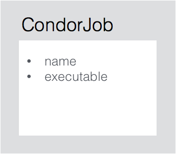
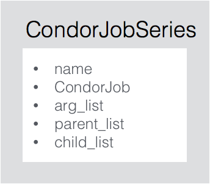
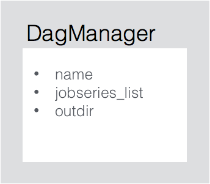
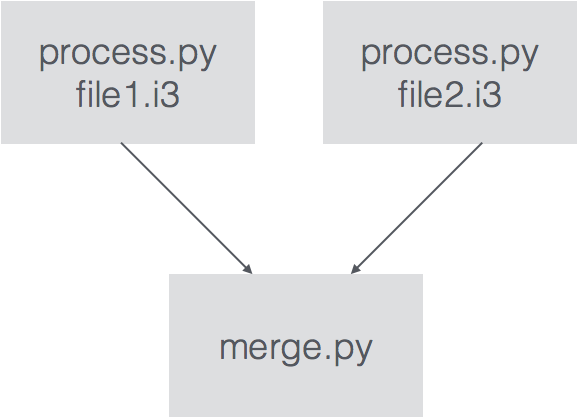

# HTCondor DAGMan management


The Directed Acyclic Graph Manager (DAGMan) is an extremely useful tool for submitting and managing a high voume of HTCondor jobs. One simply needs to create a DAG submission file and submit it to Condor.

However, when the number of jobs becomes large, especially when there are inter-job dependencies, actually making a DAG submission file can become a pain. This project is an attempt to create complex DAG submission files in a straight-forward manner.

## Core components

At the end of the day, DAGMan is used to run a set of executables with various options. In addition, there might even be some inter-job dependencies (e.g. you want job A to finish before job B begins).

So the first component is the `CondorJob` class. This is an object that simply has two members, a name and a path to the job executable file.

<!--  -->

The next component is the `CondorJobSeries` class. This is an object that encapsulates the various arguments you would like to pass to an executable and any dependencies that there might be with other jobs.

<!--  -->

The final component is the `DagManager` class. This is effectively just a container for the `CondorJobSeries` that are going into a DAG submission file.

<!--  -->

## API example

Often I find myself using DAGMan to processes a bunch of files, say `file1.i3, file2.i3, ...` and then merge the outputs into a single file. Schematically that might look like this:



Below is a a quick example of how to implement the above process using dagmanager.

```python
from dagmanager import dagman

# Specify the executables (CondorJob) that will be run
processjob = dagman.CondorJob(name='process', executable='/path/to/process.py')
mergejob = dagman.CondorJob(name='merge', executable='/path/to/merge.py')

# Specify the arguments and any dependencies
process = dagman.CondorJobSeries(name='process', condorjob=processjob)
process.add_arg('--input file1.i3 --output outputfile1.hdf5')
process.add_arg('--input file2.i3 --output outputfile2.hdf5')
merge = dagman.CondorJobSeries(name='merge', condorjob=mergejob)
merge.add_arg('--overwrite')
# Make sure process completes before merge begins
merge.add_parent(process)

# Finally create a DagManager, add all the job series, and submit!
dagmanager = dagman.DagManager(name='process_then_merge',
                               condor_data_dir='/data/user/condor',
                               condor_scratch_dir='/scratch/user/condor')

dagmanager.add_jobseries(process)
dagmanager.add_jobseries(merge)
dagmanager.build_submit()

```

All the necessary submit files will be written and the DAGMan submission file will be submitted to Condor. It's that easy!
